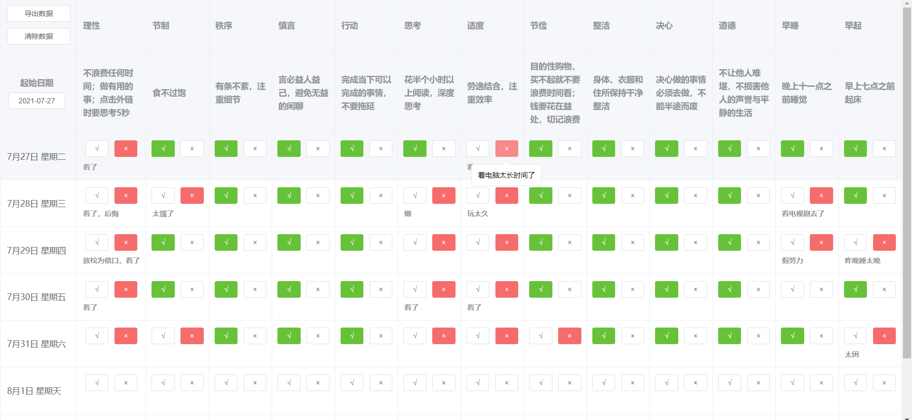

使用 Vue3 + elementPlus 做一个每日习惯打卡表

---

最近在看《富兰克林自传》，看到一篇文章叫《13个成就一生的习惯》，大致如下：

**光想着不做坏事情无法避免坏事情发生，必须将那些坏习惯打破，然后建立起好的习惯，这样才能始终如一地做正确的事**

**人们对于相同的道德品行可能有着不同的看法，比如有人把“节制”看作限制饮食，也有人将其外延扩大，认为它代表的含义包括调控欲望、癖好和肉体上或精神上的情欲，甚至将其外延扩大到野心方面**

**为了明晰其意，遂在每一条法则下面作一些注释，用以解释并限定这个词语的外延**

**一开始先密切注意“节制”这一习惯，而对于其他习惯，只是记录下过失**
**一周之后，如果发现“节制”这一习惯没有红色，就认为这一习惯已经牢固了（单个突破）**
**正如一个人替花园除草，他不能妄想一次就消灭所有的野草，这样超过了他的能力**
**如果他在一段时间内只对付一片草地，在解决一片草地后再接着解决下一片，那么工作就会更加有效**

---
**为了每天自省，结合自身情况做出修改，遂做了如下项目** ，截图如下




## 创建项目
首先，创建项目
```shell
npm init vite <project-name> --template vue
cd <project-name>
npm install
npm i element-plus
npm run dev
```
我的 project-name 叫 good_habits，项目结构如下


## 打包

直接运行，生成 dist 文件夹
```shell
npm run build
```
直接打开发现没东西，要配置什么路径乱七八糟的，懒得看了，直接改html

4个地方加4个点，使用 Live Server 运行


但是每次都要打开 VsCode 好麻烦，于是乎，写个脚本

## live-server 运行
首先，不写脚本使用命令行是怎么运行的呢？如下
先用 node 安装 live-server，进入要运行的 html 所在目录
```shell
npm install -g live-server

cd 所在目录

live-server
```

## 写脚本运行
除去安装 live-server ，就两步，所以，桌面上建立 xxx.bat 文件

编辑如下
```shell
cd C:\Users\admin\Desktop\front_project\good_habits\dist

live-server
```

是的，就两行，然后以后打卡的时候，就直接双击这个图标就可以了


> 如果同时运行两个应用，另一个应用会选择其他端口，不同端口数据会不一致